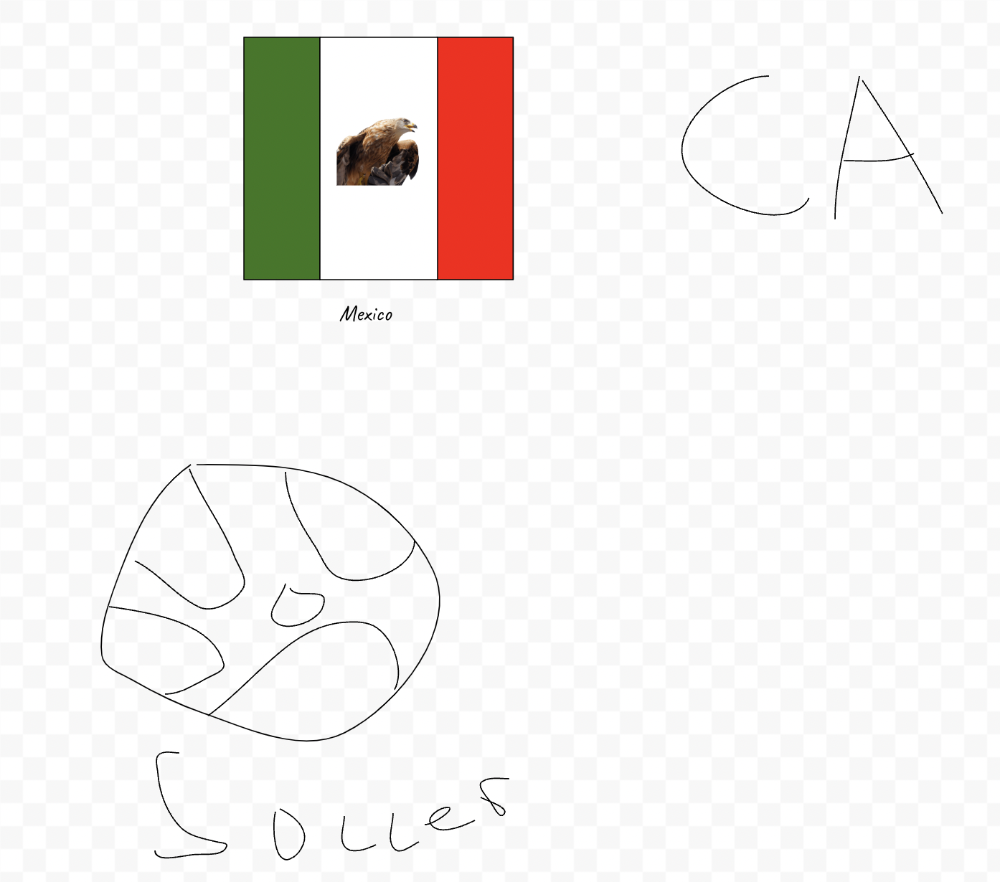

## Patricks Blog
Im an 11th grader at Del Norte Highschool, welcome to my blog!

My Freeform Drawing that mentions a few things about me

## Troubleshooting
 Most of my troubles came witht the Commiting porcess on vscode, I still dont know what it really does. I also had trouble installing homebrew becasue it was the first thing that I had to install, there was a slight learning curve becasue I have never done amny coding. When attempting to change the theme, I wasnt able to get a link when I enter the MAKE command. To fix this I removed the theme and reset it with the deafult theme that was in the teacher file.

 